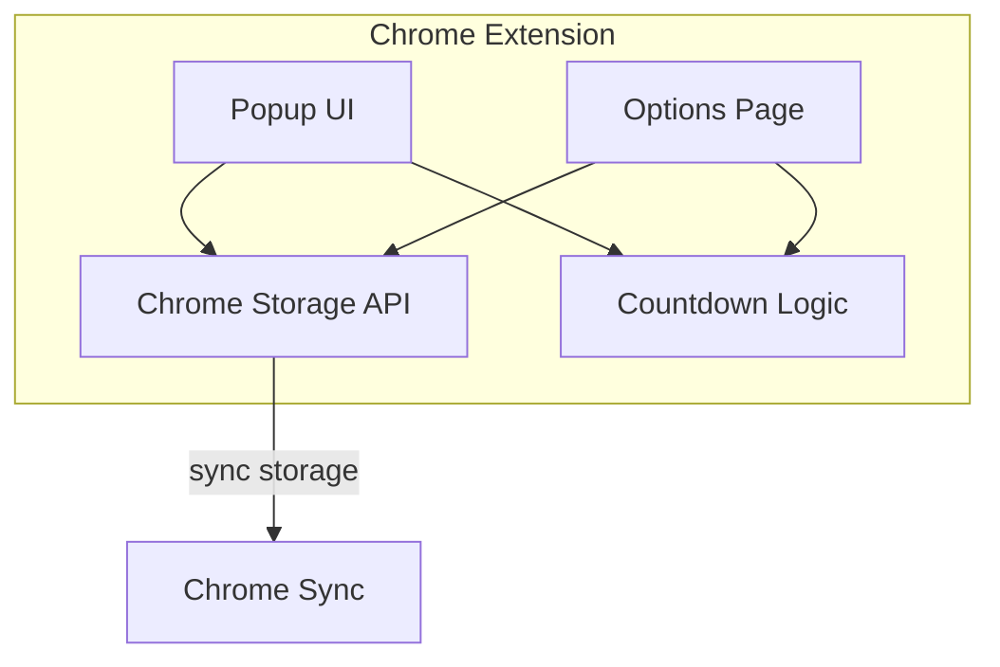

# Design Document: Spooky Countdown Timer

## Overview

The Spooky Countdown Timer is a Halloween-themed Chrome extension built on the existing extension skeleton. It transforms the template into a functional countdown application with real-time updates, dynamic theming, and persistent user settings. The extension consists of two main interfaces: a popup for displaying the countdown and an options page for configuration.

## Architecture

The extension follows a simple client-side architecture leveraging Chrome's extension APIs:



### Key Architectural Decisions

1. **No Background Script Required**: The countdown calculations happen in the popup/options page JavaScript. No persistent background processing is needed since the countdown only runs when the popup is open.

2. **Chrome Storage Sync**: Using `chrome.storage.sync` ensures settings persist across browser sessions and sync across user's devices.

3. **CSS Variables for Theming**: Theme switching is implemented via CSS custom properties, allowing instant visual updates without JavaScript DOM manipulation.

4. **Pure Functions for Countdown Logic**: Core countdown calculations are implemented as pure functions for testability and reliability.

## Components and Interfaces

### 1. Storage Interface

```typescript
interface CountdownSettings {
  eventName: string;        // Name of the event (default: "Halloween")
  targetDate: string;       // ISO date string (YYYY-MM-DD)
  targetTime: string;       // Time string (HH:MM)
  theme: Theme;             // Selected color theme
  showSeconds: boolean;     // Whether to display seconds
}

type Theme = 'pumpkin-orange' | 'ghost-white' | 'witch-purple';

const DEFAULT_SETTINGS: CountdownSettings = {
  eventName: 'Halloween',
  targetDate: '',
  targetTime: '00:00',
  theme: 'pumpkin-orange',
  showSeconds: true
};
```

### 2. Countdown Calculator

```typescript
interface CountdownResult {
  days: number;
  hours: number;
  minutes: number;
  seconds: number;
  totalMilliseconds: number;
  isPast: boolean;
}

function calculateCountdown(targetDate: Date, now: Date): CountdownResult;
```

### 3. Status Message Resolver

```typescript
type StatusMessage = {
  text: string;
  emoji: string;
};

function getStatusMessage(totalMilliseconds: number): StatusMessage;
```

### 4. Popup Component

- Displays event name
- Shows countdown timer (days, hours, minutes, optional seconds)
- Displays dynamic status message
- Provides "Edit" button to open options
- Applies selected theme via CSS class

### 5. Options Page Component

- Event name text input
- Date picker input
- Time picker input
- Theme dropdown selector
- "Show seconds" checkbox
- Save button with confirmation feedback
- Live preview section

## Data Models

### Settings Storage Schema

```typescript
// Stored in chrome.storage.sync under key 'countdownSettings'
{
  eventName: string,      // Max 50 characters
  targetDate: string,     // Format: "YYYY-MM-DD"
  targetTime: string,     // Format: "HH:MM"
  theme: string,          // One of: "pumpkin-orange", "ghost-white", "witch-purple"
  showSeconds: boolean    // true or false
}
```

### Status Message Thresholds

| Condition | Days | Message |
|-----------|------|---------|
| Far future | ≥30 | "The spirits slumber... 🪦" |
| Approaching | 7-29 | "Something stirs in the shadows 👻" |
| Near | 1-6 | "The veil grows thin! 🎃" |
| Imminent | <24h | "THE WITCHING HOUR APPROACHES 💀" |
| Past | <0 | "The haunting has begun! 🦇" |

### Theme Color Schemes

```css
/* Pumpkin Orange (Default) */
--bg-primary: #1a1a2e;
--bg-secondary: #16213e;
--accent: #ff6b35;
--text-primary: #ffffff;
--text-secondary: #b8b8b8;

/* Ghost White */
--bg-primary: #2d2d2d;
--bg-secondary: #3d3d3d;
--accent: #f0f0f0;
--text-primary: #ffffff;
--text-secondary: #cccccc;

/* Witch Purple */
--bg-primary: #1a0a2e;
--bg-secondary: #2d1b4e;
--accent: #9b59b6;
--text-primary: #ffffff;
--text-secondary: #d4b8e0;
```


## Correctness Properties

*A property is a characteristic or behavior that should hold true across all valid executions of a system-essentially, a formal statement about what the system should do. Properties serve as the bridge between human-readable specifications and machine-verifiable correctness guarantees.*

### Property 1: Countdown Calculation Consistency

*For any* valid target date and current date, the `calculateCountdown` function SHALL return a result where days, hours, minutes, and seconds correctly decompose the total time difference, and `isPast` accurately reflects whether the target is in the past.

**Validates: Requirements 1.1**

### Property 2: Status Message Threshold Correctness

*For any* time difference in milliseconds, the `getStatusMessage` function SHALL return the correct status message based on the following thresholds:
- totalMs >= 30 days → "The spirits slumber... 🪦"
- 7 days <= totalMs < 30 days → "Something stirs in the shadows 👻"
- 1 day <= totalMs < 7 days → "The veil grows thin! 🎃"
- 0 < totalMs < 1 day → "THE WITCHING HOUR APPROACHES 💀"
- totalMs <= 0 → "The haunting has begun! 🦇"

**Validates: Requirements 3.1, 3.2, 3.3, 3.4, 3.5**

### Property 3: Show Seconds Toggle Behavior

*For any* countdown result and showSeconds setting, the formatted countdown string SHALL include seconds if and only if showSeconds is true.

**Validates: Requirements 1.3, 7.2, 7.3**

### Property 4: Event Name Display

*For any* non-empty event name string, the rendered popup SHALL contain that exact event name in the display.

**Validates: Requirements 2.1**

### Property 5: Settings Persistence Round-Trip

*For any* valid CountdownSettings object, saving to Chrome storage and then loading SHALL return an equivalent settings object.

**Validates: Requirements 8.2, 8.4**

### Property 6: Theme Application

*For any* valid theme selection from the set {'pumpkin-orange', 'ghost-white', 'witch-purple'}, the popup container SHALL have the corresponding CSS class applied.

**Validates: Requirements 6.2**

### Property 7: Preview Reflects Current Settings

*For any* settings configuration in the options page, the preview section SHALL display a countdown that matches those settings (theme, showSeconds, event name).

**Validates: Requirements 9.2, 9.3**

## Error Handling

### Storage Errors

- **Chrome Storage Unavailable**: Display a user-friendly error message in both popup and options page
- **Corrupted Settings**: Fall back to DEFAULT_SETTINGS and log warning to console
- **Save Failure**: Show error message on options page, keep form data intact for retry

### Input Validation

- **Empty Event Name**: Use default "Halloween" when saving
- **Invalid Date Format**: Prevent save, highlight input with error styling
- **Missing Target Date**: Show "Configure your countdown" message in popup

### Runtime Errors

- **Date Parsing Errors**: Catch and display fallback UI
- **Timer Cleanup**: Clear intervals when popup closes to prevent memory leaks

## Testing Strategy

### Property-Based Testing

The extension will use **fast-check** as the property-based testing library for TypeScript.

Each property-based test will:
- Run a minimum of 100 iterations
- Be tagged with a comment referencing the correctness property it implements using the format: `**Feature: spooky-countdown-timer, Property {number}: {property_text}**`
- Focus on pure functions (calculateCountdown, getStatusMessage, formatCountdown)

### Unit Testing

Unit tests will cover:
- Edge cases for countdown calculation (exact threshold boundaries)
- Default settings application
- Theme CSS class mapping
- Input validation functions

### E2E Testing (Playwright)

E2E tests will verify:
- Popup displays countdown correctly
- Options page form interactions
- Settings persistence across page reloads
- Theme switching visual changes
- Edit button navigation

### Test File Structure

```
src/
├── countdown/
│   ├── countdown.ts           # Core countdown logic
│   ├── countdown.test.ts      # Unit tests
│   └── countdown.property.ts  # Property-based tests
├── popup/
│   └── popup.test.ts          # Popup unit tests
└── options/
    └── options.test.ts        # Options page unit tests
e2e/
└── extension.spec.ts          # Playwright E2E tests
```
